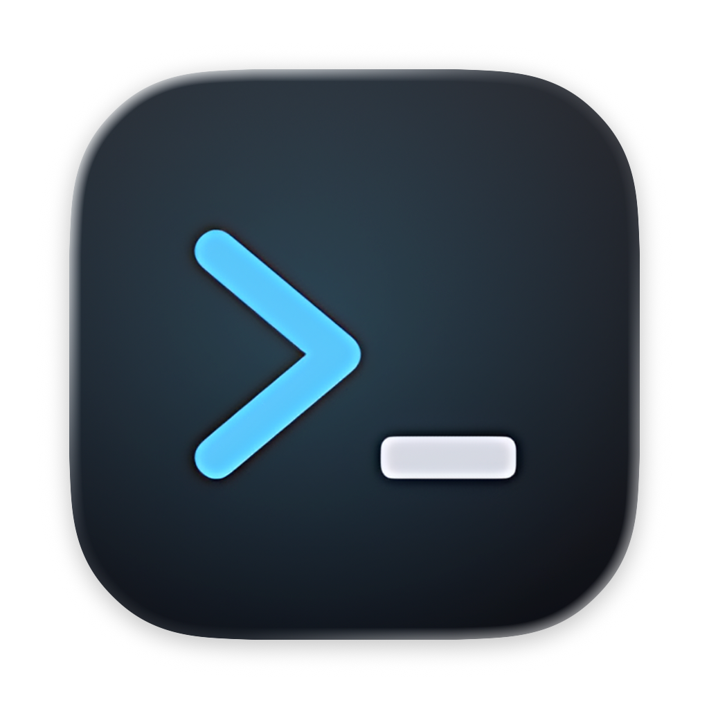
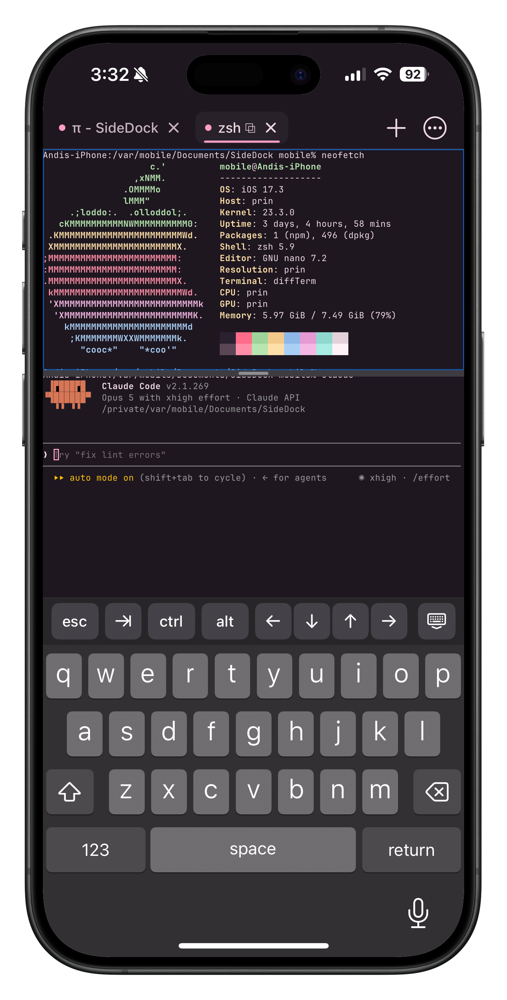
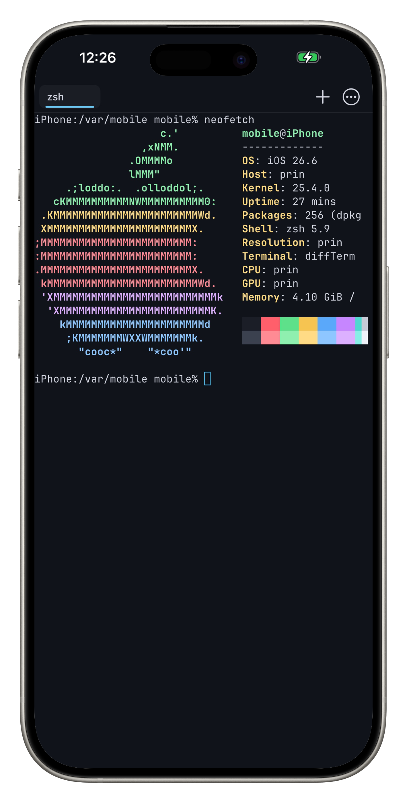

<div align="center">

# diffTerm

### *a different terminal to use*



<br>




</div>

---

diffTerm is another terminal emulator for jailbroken iOS and iPadOS devices. It runs a real shell on your device and draws the result the way a terminal is supposed to, so the tools you already use behave the way you expect. It supports iOS 14 and
later (if we can reach later).

The emulator is written from scratch against the DEC VT500 state diagram rather than pattern matching on escape sequences. It covers VT100, VT220 and xterm control sequences, 24-bit colour, the alternate screen, scroll regions, mouse reporting and the OSC extensions modern shells rely on. Accuracy is measured with esctest rather than claimed.

The iPad layout is implemented but has not yet been run on real hardware. (I don't own real hardware.)

With CarPlay, the car's screen shows whichever terminal is open on the phone and follows the cursor as output arrives or as you type. While you use the phone, the terminal keeps the phone's size and the car shrinks its text to show the phone's lines whole; lock the phone and the terminal is resized for the car instead. Tabs switch from either screen, a list in the car shows what each one is doing, and a long command finishing in any tab puts an alert on the car's screen.

A CarPlay app cannot be touched where it draws — the car routes touches to its own interface — so the keyboard is the buttons CarPlay draws for it: Ctrl-C, up, down and Return beside the text, a key pad for esc, tab, arrows and Ctrl-D, and the car's own keyboard for a whole line, which many cars withhold while moving. Real typing stays on the phone. diffTerm registers as a navigation app, because that is the only kind CarPlay lets draw its own screen. It has been run in the iOS Simulator's CarPlay screen, not yet in a real car.

## Installing

diffTerm is published in my package repository. Add the source in Sileo or Zebra and then search for diffTerm.

**Repository**

https://reallyitsandi.com/repo/

## Building

diffTerm builds on the device it runs on. You need the Procursus toolchain with `clang`, `swiftc`, `ldid`, `make` and `python3`, and the iPhoneOS SDK at `/var/jb/usr/share/SDKs/iPhoneOS.sdk`. Building a package also needs `dpkg-deb`.

The same Makefile also cross-builds on a Mac (or a CI runner) with Xcode — it picks the bootstrap SDK on-device and Xcode's otherwise.

```sh
make            # compile, bundle and sign
make test       # run the test harness
make install    # install and register the app
make package    # build a .deb
```

## Releasing

Publishing goes through the shared ios-port-ci pipeline (see `.github/workflows/release.yml`): a push to `main` rebuilds the package from source and republishes the APT repository as `VERSION-<revision>` (`2.0-1`, `2.0-2`, …) — bump `packaging/revision` when you want Sileo to offer an update. A tag like `v2.1` ships exactly `2.1`. Every published version stays downloadable, so rolling back is a normal package-manager operation.

The repository is signed with its own key, published beside the index as `diffterm.gpg`; reallyitsandi.com pins that fingerprint before syncing it into the source users actually add.

## License

MIT. See `LICENSE`.

The completion specs are derived from Fig's, also MIT, and ship with their license. The bundled font carries its own OFL license.
